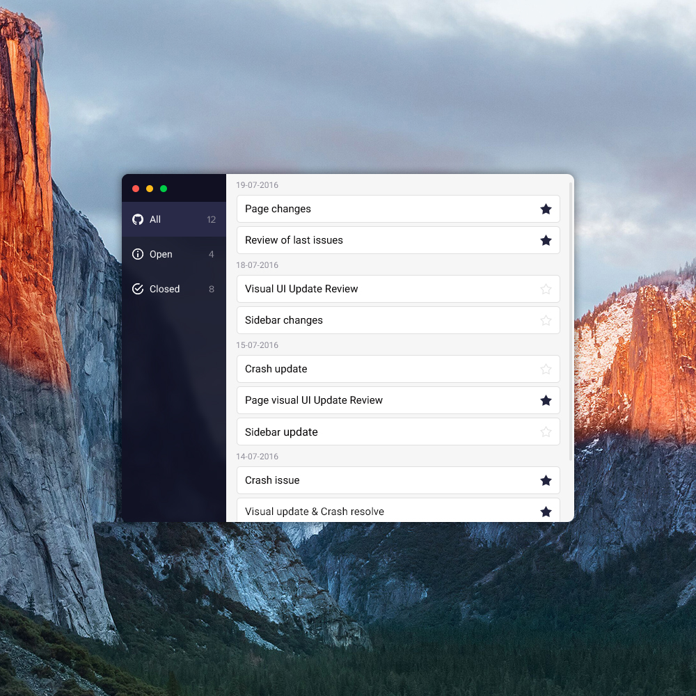

# Github Issues App layout

Implementation of the Github Issues App layout

`npm start` runs the app in the development mode.
Open [http://localhost:3000](http://localhost:3000) to view it in the browser.

## Requirements

- The template needs to have all essential elements like sidebar, navigation with filters, main frame with issues list, OSX-like buttons.
- Filter buttons in navigation should have hover and active state.
- The star in the single-issue bar needs to be clickable and change its state after click (as it is in design).
- The task concerns only the layout / template. Please do not include any business logic.

## Recommendations

- Pay attention to proper usage of HTML elements and CSS styles.
- Look to an appropriate class naming according to the known conventions.
- Try to code a template in such a way that it can be applied to a real application.
- Write your code in the component way - elements need to be reusable.
- You don’t need to change the scrollbar!
